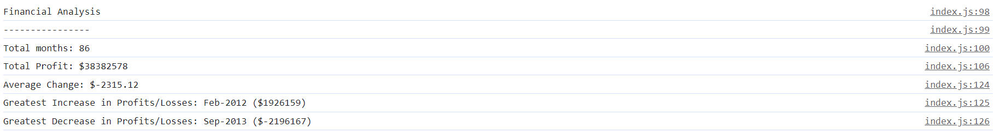
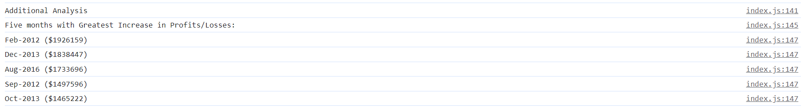
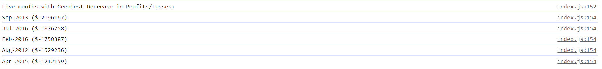

# console-finances

## Description
Console-Finances analyses the financial records of a company from Jan-2010 to Feb-2017. JavaScript is used to calculate:
* The total number of months included in the dataset.

* The net total amount of Profit/Losses over the entire period.

* The average of the **changes** in Profit/Losses over the entire period.
  * You will need to track what the total change in Profit/Losses are from month to month and then find the average.
  * (`Total/(Number of months - 1)`)

* The greatest increase in Profit/Losses (date and amount) over the entire period.

* The greatest decrease in Profit/Losses (date and amount) over the entire period.

Additional analysis is performed to determine the 5 months with greated increase/decrease in Profits/ Losses (date and amount) over the entire period.

## Usage

The complete analysis is demonstrated in the console of the deployed website: 

The additional analysis defines the top 5 5 months with greated increase/decrease in Profits/ Losses:

## License

[MIT](https://choosealicense.com/licenses/mit/)